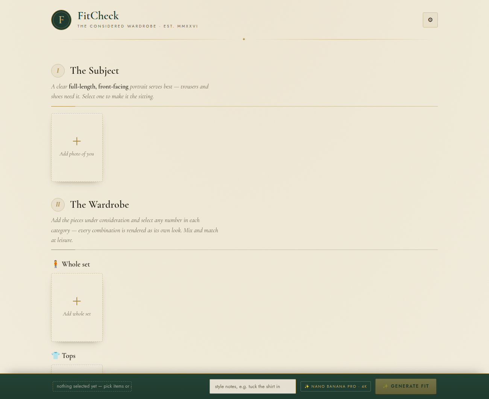
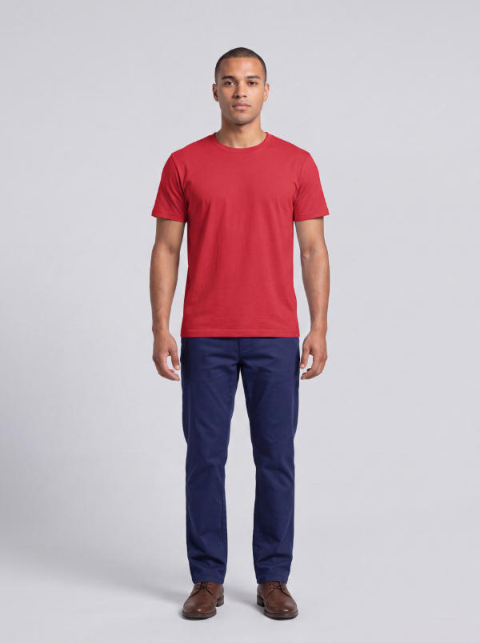

# FitCheck 👔

See how clothes look on you before you buy them.

**Live at [fitcheck.andypandy.org](https://fitcheck.andypandy.org).**

I kept ordering things online that looked great on the model and landed badly on me, so I built this to put the clothes on a photo of *me* first. It uses AI image generation to show the fit before I commit to buying.



## What it does

Upload a photo of yourself and photos of the clothes you're considering (screenshots from a shop's site work fine). Pick a top, some trousers, maybe a watch, and FitCheck generates a photorealistic image of you wearing that combination.



*(That's the demo image, not me — but you get the idea.)*

## Features

- **Mix and match** — select several tops, bottoms, or shoes and it renders every combination as its own look, so you can compare them. It shows the number of looks and the rough cost before generating.
- **Whole-set mode** — drop in one photo of a complete outfit (a flat lay, or a look you saw somewhere) and it dresses you in the whole thing, using only the clothing from that photo.
- **Import from a link** — paste a product URL (Uniqlo, Zara, COS, Mango, or most shops) and FitCheck grabs the clothing image, name, and price automatically — no screenshot. Imported pieces keep a "↗ shop" link back to the product page.
- **Browse a whole store** — paste a Yupoo store or category link and FitCheck catalogues every product (hundreds of them) as a lightweight, browsable list: just titles, thumbnails, and links, with nothing downloaded until you actually want a piece. Tap one to pull it into your wardrobe and try it on.
- **Drawers** — organise what you catalogue into named drawers ("summer fits", a particular seller, whatever makes sense to you), browse a drawer at a time, and rename or delete them as your taste shifts.
- **Smart categories** — reseller titles are usually SKU codes like "P1350suit - 116144", so rather than guess from the name, FitCheck looks at the actual photo to file each piece under the right category (top, bottoms, shoes, and so on).
- **Sync across devices** — optionally mirror your clothing library to your own storage so the same catalogue and wardrobe show up on your phone and your laptop (see [Privacy](#privacy)).
- **Hairstyle try-on** — choose a preset (buzz, Ivy League, slicked back, and so on) or upload a reference, and preview a new cut before booking the barber.
- **Backdrops** — drop yourself into a studio, street, café, beach, runway, or park, or keep your own surroundings.
- **Lookbook** — every result is saved so you can compare your options side by side.

## The model

Try-ons use Google's **Nano Banana Pro** (`gemini-3-pro-image`) at 1080p — in my testing the best at keeping your face and body consistent while changing only the clothes, which is the hard part. Each look costs roughly **$0.14** and takes about 20–40 seconds. Categorising a piece from its photo uses a cheap flash model (a fraction of a cent).

## Running it

The app itself is a single HTML file, one stylesheet, and one JavaScript file — no build step, no framework. Hosting adds a handful of small serverless functions (the key-hiding proxies, the shop importer, and optional sync).

```bash
cd fitcheck
python3 -m http.server 4173
# open http://localhost:4173
```

Add a Gemini API key in Settings (⚙) — get one at [aistudio.google.com/apikey](https://aistudio.google.com/apikey). Note that the image models have no free tier, so the key needs billing enabled.

To host it (for example, to use on your phone), it deploys to Vercel. A set of tiny functions keep your key server-side (`/api/generate`), fetch shop images without tainting the resize canvas (`/api/import`), and, if you turn it on, sync your library (`/api/sync`). Importing shops and syncing only work on the hosted version, not the bare `python -m http.server`.

## Privacy

Your photos stay in your browser (IndexedDB). The only time an image leaves your machine is the API call to Google that generates the picture — there's no account or tracking. Clearing your browser data removes everything.

Optional **cross-device sync** (off by default): set a sync secret in Settings and your *clothing library* — the catalogue and the wardrobe items imported by link — is mirrored as metadata (titles, links, categories — no image files) to your own private storage, so it's the same on every device. Your photos of yourself, generated looks, and manually uploaded files never leave the device.

## Notes

- It shows the overall look, not exact fit — it won't tell you if something runs tight in the shoulders.
- Occasionally the safety filter blocks a normal photo; a different crop usually fixes it.
- Installable to your phone's home screen (it's a PWA), and iPhone HEIC photos work.
- Built with plain JavaScript, for personal use.

---

A personal project, built for fun.
