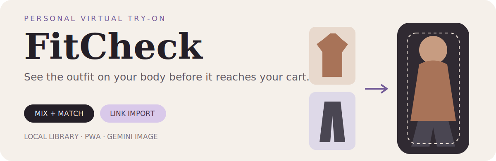

<p align="center">
  
</p>

<p align="center">
  <a href="https://fitcheck.andypandy.org"><strong>Open FitCheck</strong></a>
</p>

FitCheck is a personal virtual wardrobe for answering one question before checkout: **what will these clothes look like on me?** Add a photo of yourself, choose garments or a complete outfit, and generate a try-on that preserves the person while changing the clothes.


## From shop link to lookbook

```text
your photo + garments / complete outfit
                    ↓
             choose combinations
                    ↓
          Gemini image generation
                    ↓
             compare in Lookbook
```


## What you can do

- **Mix and match.** Select tops, bottoms, shoes, and accessories; FitCheck generates each selected combination as its own look.
- **Try a complete outfit.** Use a flat lay or outfit reference as one set instead of cataloguing every item.
- **Import a product link.** Supported shop pages can provide the image, title, price, and a link back to buy.
- **Browse large catalogues.** Import a Yupoo store or category as lightweight metadata, then fetch an item only when you want it.
- **Organise drawers.** Group catalogue and wardrobe items into named collections.
- **Categorise from the image.** A lightweight vision request can classify opaque reseller product names.
- **Sync selected metadata.** An optional, user-controlled secret can mirror catalogue and imported wardrobe metadata between devices.
- **Preview hair and backdrops.** Try hairstyle references and move generated looks into a studio, street, café, beach, runway, or park.
- **Keep a lookbook.** Generated results stay available for side-by-side comparison.

## Architecture

```text
index.html + style.css + app.js   installable PWA client
IndexedDB                         people, garments, and generated looks
api/generate.js                   server-side image-generation proxy
api/import.js                     product and catalogue importer
api/sync.js                       optional metadata sync
```

Try-ons use Google’s `gemini-3-pro-image` model at 1080p. Classification uses a lower-cost model. Generation time, availability, safety filters, and price are controlled by the upstream API and can change.

## Privacy

By default, the library lives in the browser’s IndexedDB. A person photo or garment image leaves the browser only when it is sent to Google for generation.

Optional cross-device sync is off by default. When enabled, it mirrors clothing catalogue and link-import metadata to storage controlled by the deployment. It does **not** sync person photos, generated looks, or manually uploaded image files.

Clearing browser storage removes the local library.

## Limits

- FitCheck shows the overall visual effect, not garment measurements or physical fit.
- Generative results can alter details and should not be treated as a product guarantee.
- A safety filter may reject an ordinary photo; a different crop can help.
- Store parsers depend on third-party page structures and may need maintenance as shops change.

This is a personal project, built for fun—not a retailer or sizing service.
